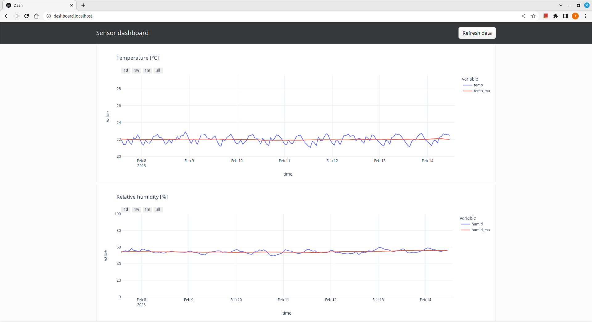

# Home temperature and humidity monitor

A simple Dash application to visualize temperature and relative humidity measured in my home.



## Running the app in Docker

To verify that the Docker is image working, run the following commands:

    docker build -t <image name>:<image tag> .
    docker run -e DATA_PATH=/data -v ./data:/data --entrypoint python <image name>:<image tag> preprocess_data.py
    docker run -e DATA_PATH=/data -v ./data:/data:ro -p 8000:8000 <image name>:<image tag>

At this point the app should be reachable under the address `http://localhost:8000/`.

## Data source

I wrote a script that reads sensor values every minute on my Raspberry Pi using crontab. The data collection is scheduled to run every minute.

The data collection script is in [this](https://github.com/tborcsok/rpi-dht22-monitor) repo.

## Syncing files from the Raspberry Pi

I found that `rsync` is a great tool to sync the data on the Pi with my laptop. I run the command like this:

    rsync -avhr -e ssh pi@raspberrypi.local:/<path to DHT22 repo on the Pi>/test_log\*.csv <path to this repo on my laptop>/data

## Convenience script to start the dashboard

I run this shell script to start the dashboard on my laptop:

```bash
#!/bin/bash

rsync -avhr -e ssh pi@raspberrypi.local:/<path to DHT22 repo on the Pi>/test_log\*.csv <path to this repo on my laptop>/data

cd <path to this repo on my laptop>

uv run python preprocess_data.py

google-chrome --new-window http://127.0.0.1:8000/ &

uv run gunicorn app:server
```

A desktop shortcut can also be added to start the app more easily. On Linux Mint I defined the shortcut as the example shows below.

```
[Desktop Entry]
Version=1.0
Type=Application
Name=RPI sensor app
Exec=bash -ic $HOME/rpi.sh
Terminal=true
```
